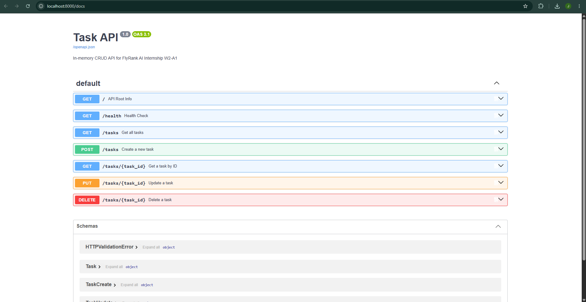

# Task API — FlyRank Backend Internship (W2-A1)

A RESTful in-memory CRUD API built with Python and FastAPI for managing a to-do list.

## Features
- **In-Memory Storage**: Initialized with sample tasks (no external database required).
- **Full CRUD Support**: Create, Read, Update, and Delete operations.
- **Input Validation**: Rejects empty task titles with HTTP 400.
- **Auto-Generated Interactive Docs**: Available via Swagger UI at `/docs`.
- **Query Filtering & Search**: Filter by completion status (`?done=true`) or search title keywords (`?search=FastAPI`).
- **Server Computation**: Stats endpoint returning real-time aggregated metrics.
- **State Reset**: POST `/reset` endpoint to restore starter tasks.

---

## How to Install and Run

1. **Clone the repository:**
   git clone https://github.com/jnoguez-qa/flyrank-backend-a1.git
   cd flyrank-backend-a1

2. **Create and activate a virtual environment:**
   python -m venv venv
   .\venv\Scripts\Activate.ps1

3. **Install dependencies:**
   pip install -r requirements.txt

4. **Start the server:**
   python -m uvicorn main:app --reload --port 8000

---

## API Endpoints Table

| Method | Endpoint | Description | Status Code |
| :--- | :--- | :--- | :--- |
| **GET** | `/` | API Information | `200 OK` |
| **GET** | `/health` | Server Health Check | `200 OK` |
| **GET** | `/tasks` | List all tasks (supports `?done=bool` & `?search=str`) | `200 OK` |
| **GET** | `/tasks/{id}` | Get single task by ID | `200 OK` / `404 Not Found` |
| **GET** | `/stats` | Get total, done, and open task metrics | `200 OK` |
| **POST** | `/reset` | Reset database to initial 3 sample tasks | `200 OK` |
| **POST** | `/tasks` | Create a new task | `201 Created` / `400 Bad Request` |
| **PUT** | `/tasks/{id}` | Update task title or status | `200 OK` / `400 Bad Request` / `404 Not Found` |
| **DELETE** | `/tasks/{id}` | Delete task by ID | `204 No Content` / `404 Not Found` |

---

## The Mortality Experiment
When creating new tasks and subsequently restarting the server process, all newly created data vanishes, reverting back strictly to the 3 initial tasks. This occurs because state is stored purely within volatile RAM memory without persistent disk storage or a database engine; restarting the server process completely clears and re-initializes memory space.

---

## Sample `curl` Output

$ curl.exe -i -X POST http://localhost:8000/tasks -H "Content-Type: application/json" -d '"{""title"":""Buy milk""}"'

HTTP/1.1 201 Created
date: Sat, 05 Sep 2026 16:24:16 GMT
server: uvicorn
content-length: 40
content-type: application/json

{"id":4,"title":"Buy milk","done":false}

---

## Swagger UI Screenshot

